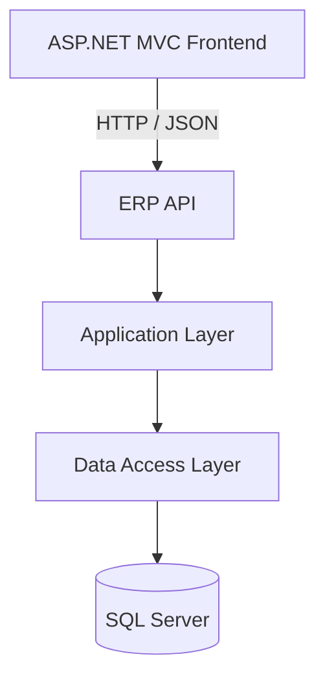
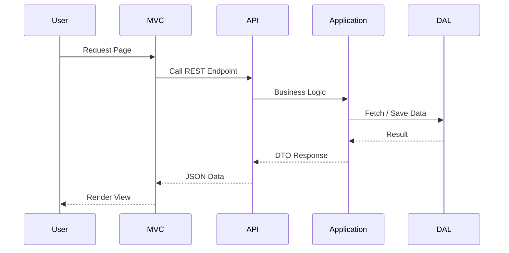

# 🚀 ERP System – .NET Multi‑Tier Architecture

<p align="center">
  
  
  
  
</p>

<p align="center">
  
</p>

---

## 🧠 System Overview

This **ERP System** is built with **.NET** using a **clean 3‑Tier architecture** and is divided into **two main projects**:

1. **ERP‑API** → Business logic & data access (REST API)
2. **ERP‑MVC** → Frontend (UI) that consumes the API

The design ensures **scalability**, **maintainability**, and **separation of concerns**.

---

## 🏗️ High‑Level Architecture



---

## 📁 Project Structure

```text
Project-main
│
├── ERP-API
│   ├── ERP-API.API          # Presentation Layer (Controllers)
│   ├── ERP-API.Application  # Business Logic
│   └── ERP-API.DataAccess   # Database & Repositories
│
├── ERP-MVC                  # Frontend (MVC)
│
├── DEPI-Project.sln
├── ProjectDoc.pdf
└── ERP-System.pptx
```

---

## 🔥 ERP‑API (3‑Tier Architecture)

<p align="center">
  
</p>

### 1️⃣ API Layer (Presentation)

📍 `ERP-API.API`

**Responsibilities:**

* Expose RESTful endpoints
* Handle HTTP requests & responses
* Authentication & Authorization

**Key Components:**

* Controllers
* Program.cs
* API Extensions

---

### 2️⃣ Application Layer (Business Logic)

📍 `ERP-API.Application`

**Responsibilities:**

* Business rules & workflows
* DTOs for clean data transfer
* Service interfaces & implementations

**Key Components:**

* DTOs
* Services
* Interfaces

---

### 3️⃣ Data Access Layer (DAL)

📍 `ERP-API.DataAccess`

**Responsibilities:**

* Database communication
* Entity Framework Core
* Repository pattern

**Key Components:**

* DbContext
* Entities & Enums
* Migrations
* Repositories
* Identity & Security

---

## 🎨 ERP‑MVC (Frontend Layer)

<p align="center">
  
</p>

**Responsibilities:**

* User Interface (UI)
* Consumes ERP‑API
* Handles user interaction

**Structure:**

* Controllers
* Views (Razor Pages)
* Services (API communication)
* Models (ViewModels & DTOs)
* wwwroot (CSS / JS / Assets)

---

## ✨ Key Features

✅ Modular & Scalable Architecture

✅ Clean Separation of Concerns

✅ RESTful API Integration

✅ Entity Framework Core + Migrations

✅ Identity & Role Management

✅ Secure Configuration (appsettings)

✅ Ready for Enterprise‑Level Expansion

---

## 🔄 Request Flow Animation



---

## 🚀 How to Run

1️⃣ Open `DEPI-Project.sln`

2️⃣ Set **Multiple Startup Projects**:

* ERP-API.API
* ERP-MVC

3️⃣ Update connection string in:

* `appsettings.json`

4️⃣ Apply migrations:

```bash
dotnet ef database update
```

5️⃣ Run the solution 🎉

---

## 🧩 Future Enhancements

* 📊 Advanced Financial Reports
* 📦 Inventory Forecasting
* 👥 Role‑Based Dashboards
* 📱 Mobile App Integration
* ☁️ Cloud Deployment (Azure)

---

## 👨‍💻 Author

**Eng. Joe**
.NET | ERP | Clean Architecture

---

<p align="center">
  ⭐ If you like this project, give it a star!
</p>
